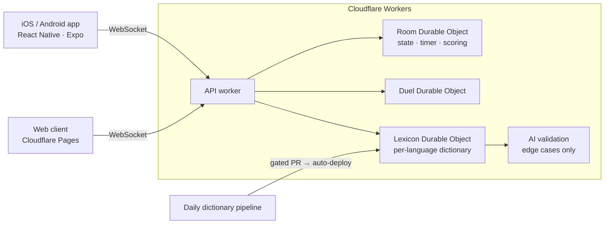

# Architecture

## Key decisions

| Decision | Why |
|---|---|
| One Durable Object per room | Each room has exactly one authoritative copy of game state, so there's no race between players and no database locks |
| Edge-hosted, no servers to manage | Low latency for players across Europe, and almost no ops work |
| Dictionary first, AI as fallback | Fast, cheap and predictable. AI handles only the long tail of unusual answers |
| Language as configuration | A new market costs days, not months |
| Room codes as the only access control | A public party game needs no accounts, and that's a deliberate, documented trade-off |
